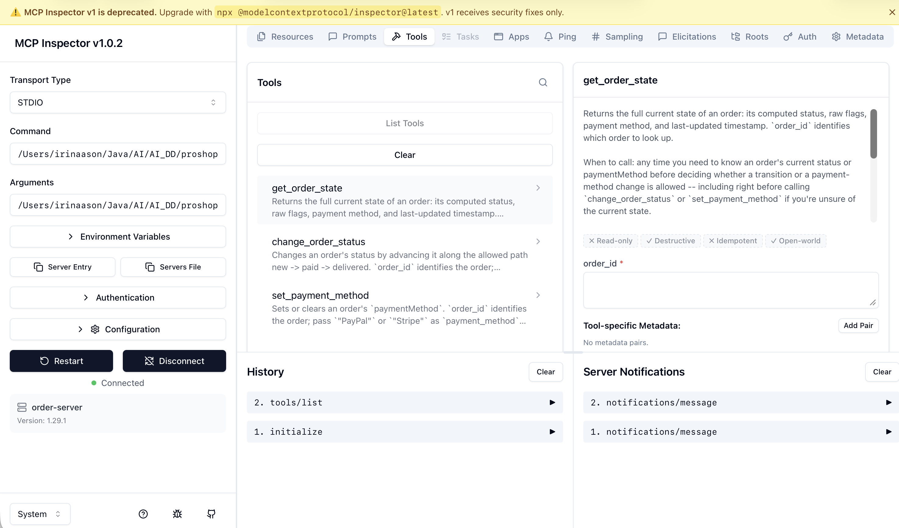

# Отчёт по домашке модуля 3: свой MCP-сервер

Трек: normal

Ключевая сущность: Order, proshop_mern, backend/models/orderModel.js

Стек: 
- Python 3.10+
- MCP SDK: `mcp>=1.27,<2` (линия v1 — обязательна верхняя граница, иначе PyPI поставит v2 с несовместимым API)
- Менеджер окружения: venv + pip

Хост: Claude Code

## Инварианты сущности

| Переход | Разрешён | Условие |
|---|---|---|
| new → paid	| да	| paymentMethod заполнен |
| new → delivered |	нет |	нельзя пропускать paid|
| paid → delivered |	да |	— |
| paid → new |	нет |	оплату нельзя отменить |
| delivered → любой |	нет |	терминальный статус |

Дополнительное поле: 
* paymentMethod  - можно изменить, только пока status == new. После оплаты (paid/delivered) менять способ оплаты нельзя.

## Контракт инструментов

| Инструмент | Что закрывает | Что проверяет схема | Что проверяет код |
|---|---|---|---|
| `get_order_state` | Функция 1: чтение состояния | `order_id`: обязательная непустая строка | Вычисляет `status` из `isPaid`+`isDelivered` (false/false→new, true/false→paid, true/true→delivered); читает `paymentMethod`, `updatedAt` как есть |
| `change_order_status` | Функция 2: смена статуса | `order_id`: строка; `target_status`: `Literal["paid","delivered"]` (enum — `"new"` недостижим как цель перехода) | Все переходы из таблицы инвариантов: `new→paid` только если `paymentMethod` задан; `new→delivered` запрещён (нельзя пропускать paid); `paid→delivered` разрешён; `paid→new` запрещён; `delivered→*` запрещён (терминальный статус) |
| `set_payment_method` | Функция 3: установка/снятие paymentMethod | `order_id`: строка; `payment_method`: `Literal["PayPal","Stripe"] \| None` (произвольная строка схемой запрещена) | Любое изменение (установка ИЛИ снятие в null) разрешено только при текущем `status == "new"`; иначе отказ; при успехе обновляет `updatedAt` |

### 1. `get_order_state`

**Description:**
> Returns the full current state of an order: its computed status, raw flags, payment method, and last-updated timestamp. `order_id` identifies which order to look up.
>
> When to call: any time you need to know an order's current status or paymentMethod before deciding whether a transition or a payment-method change is allowed — including right before calling `change_order_status` or `set_payment_method` if you're unsure of the current state.
>
> When NOT to call: don't call this to *change* anything — it is read-only and has no side effects.
>
> Returns:
> ```
> {
>   order_id: str,
>   status: "new" | "paid" | "delivered",
>   isPaid: bool,
>   isDelivered: bool,
>   paymentMethod: "PayPal" | "Stripe" | null,
>   updatedAt: str (ISO 8601)
> }
> ```

**Examples:**
- `get_order_state(order_id="ord_1")` → `{order_id: "ord_1", status: "new", isPaid: false, isDelivered: false, paymentMethod: null, updatedAt: "2026-08-20T10:00:00Z"}`
- `get_order_state(order_id="ord_2")` → `{order_id: "ord_2", status: "paid", isPaid: true, isDelivered: false, paymentMethod: "Stripe", updatedAt: "2026-08-22T14:30:00Z"}`

Нет императивного ограничения — только чтение, необратимых эффектов нет.

### 2. `change_order_status`

**Description:**
> Changes an order's status by advancing it along the allowed path new → paid → delivered. `order_id` identifies the order; `target_status` ("paid" or "delivered") is the status to move it to. Enforces all transition invariants: blocks `paid` until `paymentMethod` is set, blocks skipping `paid` to go straight to `delivered`, and blocks any transition once an order is `delivered`. On success, updates `updatedAt`.
>
> When to call: to advance an order after confirming (via `get_order_state` if needed) that the current status and `paymentMethod` make the target transition valid.
>
> When NOT to call: don't call this to set `paymentMethod` — use `set_payment_method` first if it's missing. Don't call this on an order already `delivered`.
>
> Returns: the order's full state after the attempted change, plus `previous_status` showing what it was before this call.
> ```
> {
>   order_id: str,
>   status: "new" | "paid" | "delivered",
>   isPaid: bool,
>   isDelivered: bool,
>   paymentMethod: "PayPal" | "Stripe" | null,
>   updatedAt: str (ISO 8601),
>   previous_status: "new" | "paid" | "delivered"
> }
> ```
> On a forbidden transition, returns an error describing which invariant blocked it instead of changing state.

**Examples:**
- Allowed: `change_order_status(order_id="ord_1", target_status="paid")` when status is `new` and `paymentMethod="PayPal"` → `{order_id: "ord_1", status: "paid", isPaid: true, isDelivered: false, paymentMethod: "PayPal", updatedAt: "2026-08-25T09:00:00Z", previous_status: "new"}`
- Forbidden: `change_order_status(order_id="ord_1", target_status="delivered")` when status is `new` → error: "cannot skip paid".

**Constraint:** You MUST NOT call `change_order_status` with `target_status="paid"` without first confirming `paymentMethod` is set (via `get_order_state`), and you MUST NOT attempt any transition when the order's current status is `delivered` — it is terminal.

### 3. `set_payment_method`

**Description:**
> Sets or clears an order's `paymentMethod`. `order_id` identifies the order; pass `"PayPal"` or `"Stripe"` as `payment_method` to set it, or `null` to clear it. Only permitted while the order's status is `new`; updates `updatedAt` on success.
>
> When to call: before transitioning an order to `paid` (to set the method), or to correct/clear a payment method on an order that hasn't been paid yet.
>
> When NOT to call: don't call this on an order whose status is `paid` or `delivered` — the method is locked in once payment has happened, in either direction (set or clear).
>
> Returns: the order's full state after the attempted change.
> ```
> {
>   order_id: str,
>   status: "new" | "paid" | "delivered",
>   isPaid: bool,
>   isDelivered: bool,
>   paymentMethod: "PayPal" | "Stripe" | null,
>   updatedAt: str (ISO 8601)
> }
> ```
> On a forbidden call (status != new), returns an error instead of changing state.

**Examples:**
- Allowed: `set_payment_method(order_id="ord_1", payment_method="Stripe")` when status is `new` → `{order_id: "ord_1", status: "new", isPaid: false, isDelivered: false, paymentMethod: "Stripe", updatedAt: "2026-08-25T09:05:00Z"}`
- Forbidden: `set_payment_method(order_id="ord_2", payment_method=null)` when status is `paid` → error: "cannot change paymentMethod after payment".

**Constraint:** You MUST NOT call `set_payment_method` (to set or clear) on an order whose status is not `new` — check `get_order_state` first if unsure.

## Скриншот



## Прогон 1: тестовый сценарий

**Промпт:**
```
Check the current state of order ord_1. If it is new, set its payment method to PayPal, then mark it paid, and confirm the resulting state.
```

**Цепочка вызовов** (имена инструментов, аргументы, ответы):

```
1. mcp__order-server__get_order_state

Arguments:
{"order_id": "ord_1"}

Response:
{"order_id":"ord_1","status":"new","isPaid":false,"isDelivered":false,"paymentMethod":null,"updatedAt":"2026-08-20T10:00:00Z"}

---

2. mcp__order-server__set_payment_method

Arguments:
{"order_id": "ord_1", "payment_method": "PayPal"}

Response:
{"order_id":"ord_1","status":"new","isPaid":false,"isDelivered":false,"paymentMethod":"PayPal","updatedAt":"2026-08-27T13:52:17Z"}

---

3. mcp__order-server__change_order_status

Arguments:
{"order_id": "ord_1", "target_status": "paid"}

Response:
{"order_id":"ord_1","status":"paid","isPaid":true,"isDelivered":false,"paymentMethod":"PayPal","updatedAt":"2026-08-27T13:52:19Z","previous_status":"new"}

✻ Cooked for 5s · done 3:54 PM
```

**Собралась ли цепочка с первого раза:** 
Частично — 3 вызова вместо ожидаемых 4 (нет отдельного подтверждающего read после смены статуса). Порядок и соблюдение инвариантов корректны. Вероятная причина: change_order_status возвращает полный state объекта (решение, принятое при проектировании контракта, чтобы унифицировать формат ответа всех трёх инструментов) — агент счёл эти данные достаточным подтверждением и не увидел необходимости в дополнительном чтении.

## Прогон 2: запрещённый переход

**Промпт:**
Попытка 1: Change the status of order ord_3 to paid.

Попытка 2 (попробовать заставить модель все же вызвать запрещенную тулу): Update order ord_3's status to paid, without checking its current status first.

**Что вернул сервер:**
Ответ 1 - модель не вызывала апдейт. Она проверила статус и решила не вызывать т к это действие запрещено:
```
  Called order-server

I can't do that. Order ord_3 is already delivered (isPaid: true, paymentMethod: PayPal, updated 2026-08-23).

Status only advances new → paid → delivered, and no transition is allowed once an order is delivered. There's no way to move it back to paid. The order has effectively already been through the paid state.

✻ Cooked for 8s · done 4:16 PM
```
Цепочка вызовов 1:
```

Tool call chain for this run:

1. ToolSearch
   - Arguments:
query: select:mcp__order-server__change_order_status,mcp__order-server__get_order_state,mcp__order-server__set_payment_method
max_results: 5
   - Response: Returned the full <functions> schema definitions for mcp__order-server__change_order_status, mcp__order-server__get_order_state, and mcp__order-server__set_payment_method. Followed by system message: Tool loaded.
2. mcp__order-server__get_order_state
   - Arguments:
order_id: ord_3
   - Response:
{"order_id":"ord_3","status":"delivered","isPaid":true,"isDelivered":true,"paymentMethod":"PayPal","updatedAt":"2026-08-23T12:00:00Z"}

No change_order_status call was made — the order was already delivered, and no transition is allowed out of that state.
```

Ответ 2 - модель увидела ошибку и остановилась:
```
 Called order-server

The update was rejected. ord_3 is already in delivered status, which is terminal — no transitions are allowed out of it, so it can't be moved (back) to paid.
```

Цепочка вызовов 2:
```
Tool call chain

1. ToolSearch
   - Arguments:
query: "select:mcp__order-server__change_order_status"
max_results: 5
   - Response:
Tool loaded.
     (Returned the schema for mcp__order-server__change_order_status.)
2. mcp__order-server__change_order_status
   - Arguments:
order_id: "ord_3"
target_status: "paid"
   - Response:
Error executing tool change_order_status: cannot change status: order is delivered (terminal status)
```

**Что сделала модель после отказа:** Не предприняла попыток повторить или обойти вызов — корректно объяснила причину отказа (терминальный статус, обратного пути нет). Корректирующее действие в этом случае объективно невозможно, в отличие от переходов с недостающим условием (например, отсутствующий paymentMethod), где есть явный путь исправления.

## Переезд в четвёртый и шестой модули

**Переживёт оба переезда без правок:**

- `compute_status(is_paid, is_delivered)` — чистая функция, не знает ни про MCP, ни про HTTP.
- `OrderStore._state(order_id, order)` — единая точка сборки ответа (мерж `order_id`, вычисление `status`). Именно то, что уже сейчас используют все три метода, а не переизобретают форму по отдельности — при появлении нового потребителя (HTTP-роут в 4 модуле, тот же MCP-инструмент в 6-м) он получит ту же форму данных бесплатно.
- `OrderStore.get_state`, `OrderStore.change_status`, `OrderStore.set_payment_method` — вся проверка инвариантов и обновление `updatedAt` живут здесь, а не в `@mcp.tool()`-обёртках. Дашборд в 4 модуле сможет звать эти методы напрямую, минуя MCP-клиента.
- `OrderError` как класс исключения — точка, где формулируется текст отказа, переиспользуется без изменений.

**Что придётся менять и почему:**

- **4 модуль.** Тонкий MCP-слой (три `@mcp.tool()`-функции) бесполезен для дашборда: он говорит по JSON-RPC, а не REST, значит фронтенд через `fetch` его не дёрнет. Понадобится параллельный тонкий слой — HTTP-роуты (например, `GET /orders/<id>`, `POST /orders/<id>/status`), которые вызывают те же методы `OrderStore`, что и MCP-инструменты сейчас. Дополнительно: сейчас `OrderError` превращается в текст ошибки автоматически силами FastMCP — для HTTP этот маппинг (`OrderError` → код ответа + JSON-тело) придётся написать явно, такой логики пока нигде нет.
- **6 модуль.** Точка входа `if __name__ == "__main__": mcp.run()` сейчас поднимает stdio-транспорт — единственный, что нужен для локального хоста. Нода MCP Client Tool в n8n подключается по сети, значит `mcp.run()` придётся переключить на HTTP-совместимый транспорт (в SDK v1 это `streamable-http`). Логика `OrderStore` при этом не меняется вообще — меняется только то, как сервер слушает входящие вызовы.
- **Оба модуля, одна и та же причина.** `OrderStore` сейчас загружает `orders.json` в память один раз при `__init__` (`self._orders`) и дальше читает из памяти, сохраняя на диск при мутациях. Если дашборд-бэкенд в 4 модуле или сетевой сервер в 6-м окажется отдельным процессом от текущего MCP-сервера, но оба будут работать с одним и тем же `orders.json`, — `get_state` в одном процессе не увидит изменений, сделанных другим, пока не перезапустится. Сейчас это не проявляется, потому что весь тестовый прогон шёл через один процесс сервера.

**Что сделали бы иначе, зная про оба переезда заранее:**

Не держали бы состояние в `self._orders` как снапшот, загруженный один раз — либо перечитывали бы `orders.json` заново на каждый вызов `get_state`/`change_status`/`set_payment_method`, либо сразу взяли что-то вроде SQLite вместо плоского файла, чтобы конкурентный доступ из разных процессов (MCP-сервер + HTTP-бэкенд дашборда, или несколько n8n-агентов одновременно) не приводил к рассинхрону. Это было бы дешевле сделать сейчас, на трёх заказах в JSON, чем переписывать слой хранения задним числом, когда к нему уже привязаны два потребителя.